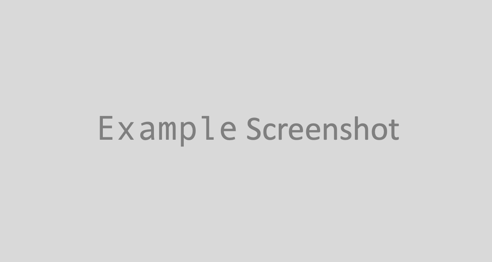

# Project Title

(Introduction goes here.) This is a Readme template for a real life project including almost all readme markdown syntax...




## Prerequisites

* Laravel5.7
* PHP7.2
* MySql


## Installation

* Install PHP
  * `brew search php`
  * `brew install php@7.2`
  
* Install MySql 
  * `brew install mysql@5.7`
  
* `git clone <repo>`
* install composer packages
    * `cd <project directory>`
        * `composer install`

## Development set up and run the app

1. Set up local development server
   * Start up a local development server with php artisan serve And, visit http://localhost:8000/.
      * `php artisan serve`

2. Aternativly we can set up a robust local development virtual server

   * Install VirtualBox and Vagrant
     * https://www.virtualbox.org/wiki/Downloads
     * https://www.vagrantup.com/downloads.html 

   * Add an /etc/hosts file entry for homestead.test or the domain of your choice.
     * On Mac and Linux, this file is located at /etc/hosts, open it and add the line below(Make sure the IP address listed is the one set in your Homestead.yaml file):

     <br> `192.168.10.10  homestead.test`

   


## Production Setup

* Web Server
```
     Elastic Beantalk with auto scale
     Deploy via EB-CLI
     
```
* Database
```
    RDS MySQL (separately setup, not part of EB)
```
* Images and Assets
```
    S3 Buckets
```
* Image resizing
```
    Image auto-resize is done via a lambda function in AWS with a s3 upload trigger.
    Lambda fucntion can be found here https://github.com/DnSu/aws-s3-lambda-crop-n-resize
```

## Deployment

* Deploy via EB-CLI
  * `eb deploy`
* Deploy via Elastic Beanstalk console
  * Upload and Deploy


## Version or Release History

We use [SemVer](http://semver.org/) for versioning.

or 

* 0.2.1
    * CHANGE: Update docs (change framework)
* 0.2.0
    * CHANGE: Remove `stripe`
    * ADD: Add `braintree`
* 0.1.1
    * First production release
* 0.1.0
    * Fix image resizing bug
* 0.0.1
    * Initial release 


## Authors

* **Joseph Fan** - *Final work* - [josephxwf](https://github.com/josephxwf)


## License

This project is licensed under the MIT License 

